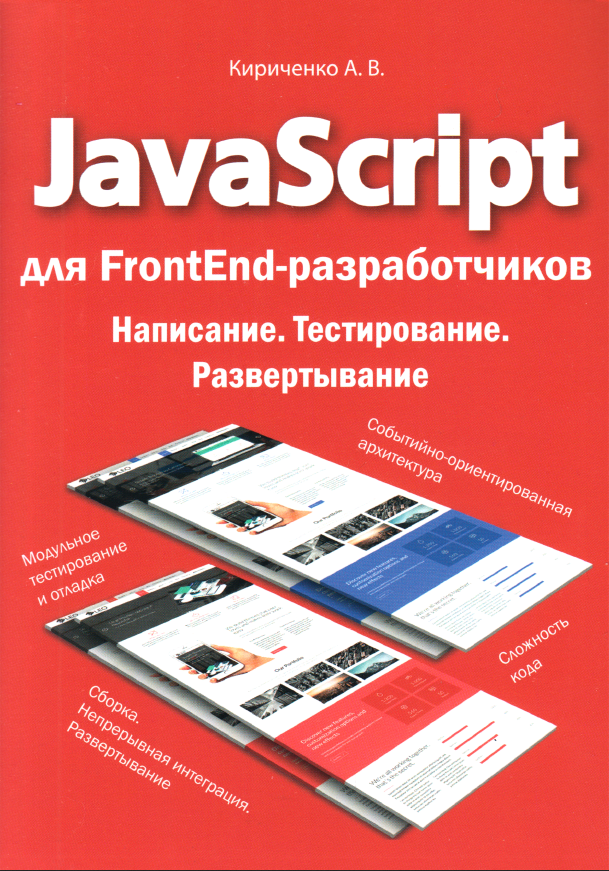

JS
======

Проэкт Эйлера. Используя язык программирования **JavaScript**. Посмотреть мое ришение можно в папке Challenges.
 >Паралельно читаю книги по основам языка, таким образом закрепляю метериал на практике.
 Сегодня стартую одну из книг по JS. Обложку добавил для закрепления информации.
 
 ## JavaScript для FontEnd-разработчиков.
 #### автор: *Кириченко А.В.* 

 -------------------
 
